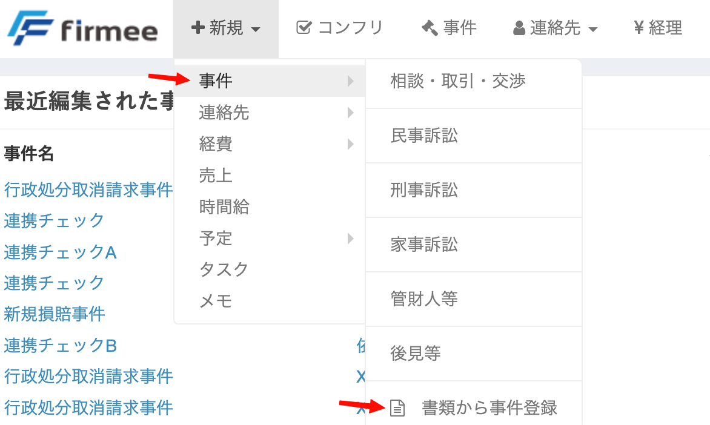
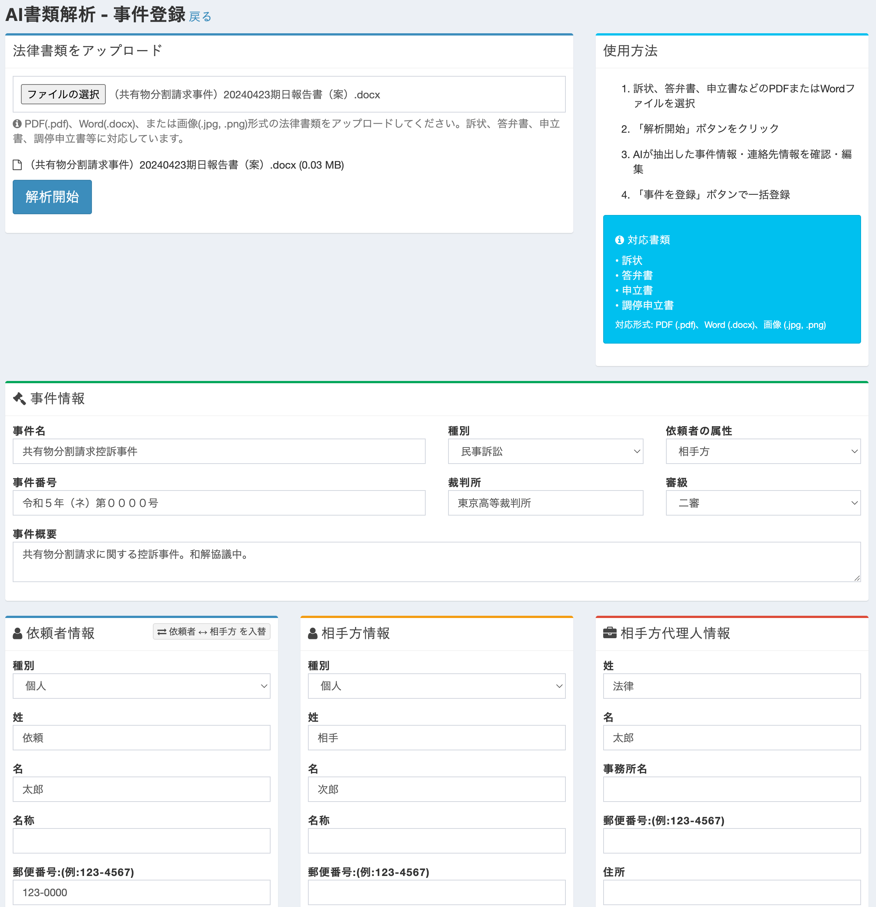

# 書面アップロードによるAI自動事件登録

## 書面アップロードによるAI自動事件登録

#### 概要

訴状や申立書などの書面ファイルをアップロードするだけで、AIが書面の内容を自動的に解析し、事件登録に必要な情報を抽出する機能です。抽出された情報はそのまま事件登録に反映できるため、手入力の手間を大幅に削減できます。

#### 主な機能

**AIによる書面解析と情報抽出**

アップロードされた書面から、AIが以下の情報を自動的に抽出します：

* **事件名**：書面の内容から適切な事件名を生成
* **事件番号**：訴状や申立書に記載された事件番号を認識
* **裁判所**：管轄裁判所の情報を抽出
* **当事者情報**：依頼者、相手方の名前・住所など、原告・被告、申立人・相手方などの当事者に関する情報を抽出

**対応ファイル形式**

以下の形式のファイルをアップロードできます：

* **PDF**：訴状や申立書のPDFファイル
* **Word（.docx）**：Word形式の書面ファイル
* **画像（JPEG、PNG）**：書面をスキャンした画像や撮影した写真

**抽出結果の確認と編集**

AIが抽出した情報は、事件登録画面にプレビュー表示されます。内容を確認し、必要に応じて修正したうえで、そのまま事件登録を実行できます。

#### こんな場面で便利です

* **新件の訴状が届いたとき**：訴状をアップロードするだけで、事件名・事件番号・裁判所・当事者情報が自動入力されます。
* **相手方から申立書を受領したとき**：申立書の内容をAIが読み取り、必要な情報を即座に抽出します。
* **まとめて複数案件を登録したいとき**：書面を順次アップロードすることで、複数の事件を効率的に登録できます。

#### 利用方法

**1. 事件登録画面へのアクセス**

1. トップのナビゲーションバーから「新規作成」をクリックします
2. 「事件」をクリックします
3. 「書類から事件登録」をクリックします

<figure><figcaption></figcaption></figure>

**2. 書面のアップロード**

1. 「ファイルの選択」ボタンをクリックします
2. 訴状や申立書などの書面ファイルを選択します
   * **対応形式**：PDF、Word（.docx）、JPEG、PNG
3. アップロード後、AIが自動的に書面の解析を開始します

**3. 抽出結果の確認**

AIによる解析が完了すると、抽出された情報が画面下部に表示されます：

1. 事件名、事件番号、裁判所などの情報を確認します
2. 当事者情報（原告・被告など）を確認します
3. 必要に応じて各項目を修正します

<figure><figcaption></figcaption></figure>

**4. 事件登録の実行**

1. 全ての情報を確認したら「登録」ボタンをクリックします
2. 事件ファイルが作成され、抽出された情報が反映されます

#### 注意事項

**データの正確性**

* AI解析は高精度ですが、100%の正確性を保証するものではありません
* 登録前に必ず抽出結果を確認し、必要に応じて修正してください
* 特に事件番号や当事者名については慎重にご確認ください

**セキュリティとプライバシー**

* アップロードされたファイルは処理完了後、安全に管理されます
* ファイルデータは暗号化された通信（HTTPS）で送信されます

#### 関連機能

* [事件ファイル](func_matter.md)
* [一括インポート機能](inpto.md)
* [連絡先](func-contacts.md)

#### サポート

この機能に関するご質問やお困りの点がございましたら、firmeeサポートチームまでお問い合わせください。
