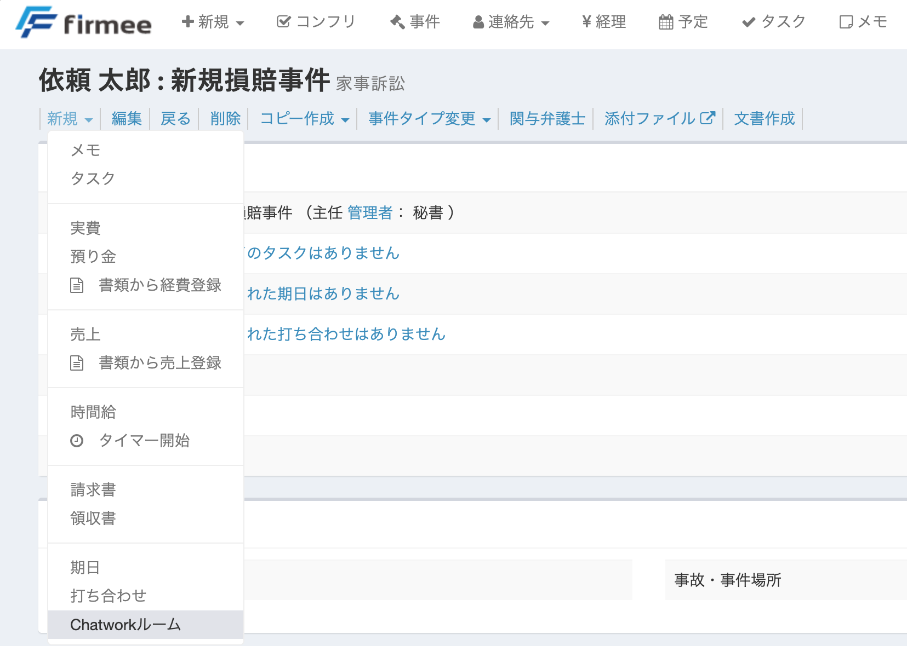

# Chatwork連携

firmeeとChatworkを連携すると、事件ごとのChatworkルームを事件詳細ページから作成できます。

## 使い方

### １　プロフィールからChatworkを連携する

１ 画面右上の歯車ボタンから「プロフィール」を開きます。

２ プロフィールページの「Chatwork連携」をクリックします。

３ Chatwork側で表示される内容を確認して、firmeeとの連携を許可します。

連携が完了すると、プロフィールページのボタンが「Chatwork連携済」に変わります。

### ２　事件ごとのChatworkルームを作成する

１ 事件詳細ページを開き、「新規」メニューから「Chatworkルーム」を選びます。


「Chatworkルーム」は、その事件の主任弁護士がChatwork連携を済ませている場合に表示されます。表示されないときは、主任弁護士のプロフィールページでChatwork連携をご確認ください。


２ 事件名をもとにした名前でChatworkルームが作成され、Chatwork連携済みの事件関与者がメンバーとして追加されます。

３ 作成後は、事件詳細ページに「Chatwork」ボタンが表示されます。クリックすると、その事件のChatworkルームが開きます。

Chatworkルームは1つの事件につき1つです。作成済みの事件では、「新規」メニューに「Chatworkルーム」は表示されません。
