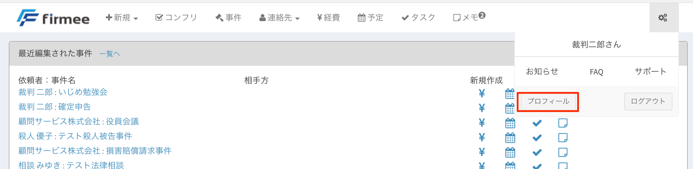
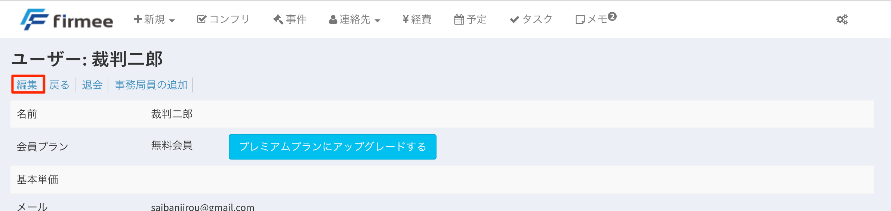
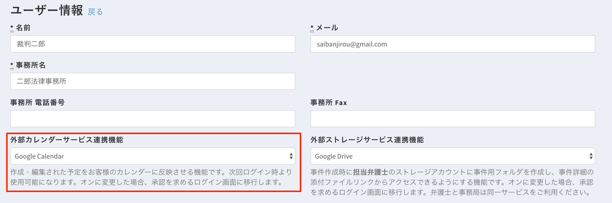
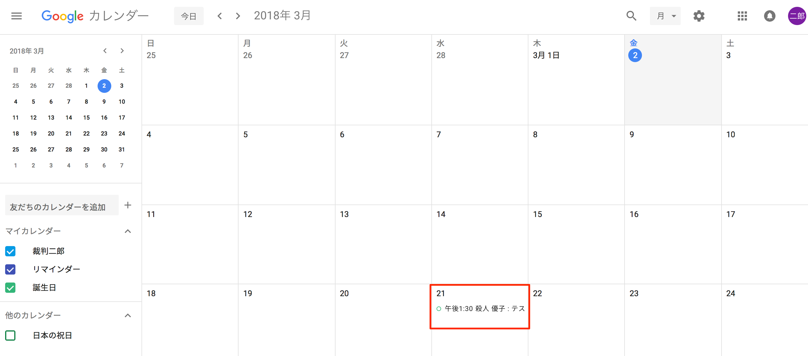

# カレンダー連携

打ち合わせや期日、タスクの締め切りなどが、外部のカレンダーアプリに反映されます。\
2018年3月現在、対応アプリは、Google社のGoogle Calendarです。 \

## 特徴

* 事務局アカウントで作成した予定は自動的に担当弁護士の予定に反映されます。
* トップページにカレンダーを表示できます。
* 複数カレンダーの表示も可能です。 \

## 使い方

１ 歯車ボタン→「プロフィール」をクリックします。

２ 「編集」をクリックします。 

３ 「外部カレンダーサービス連携機能」を選択します。 

\
&#x20;４ 「Google Calendar」を選択してページ下部の「更新」ボタンを押します。

\
&#x20;５ Google Calendarに、firmeeで登録した予定が反映されるようになります。

## 複数カレンダーの表示

複数のカレンダーをタブで管理してトップページに表示できます。 ※作成方法は[こちら](https://www.slideshare.net/DaisukeIgeta/tutorial-for-calendar)をご参照ください。

こんな方にオススメです。

* 複数の弁護士を担当する事務局アカウント
* プライベートと仕事の予定を分けてGoogle Calendarに登録していて、仕事の予定だけを事務局と共有しつつ、プライベートの予定も自分のトップページには表示させたい弁護士アカウント
* イソ弁の仕事の予定を把握して適切な労務管理を実現させたいボス弁アカウント
