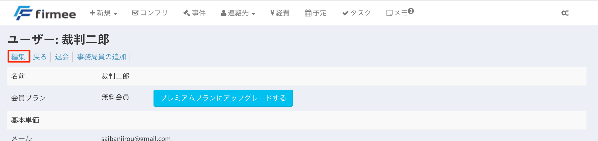
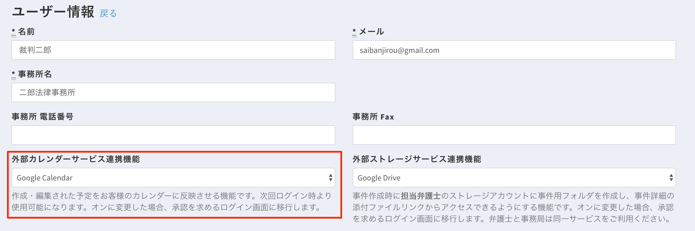
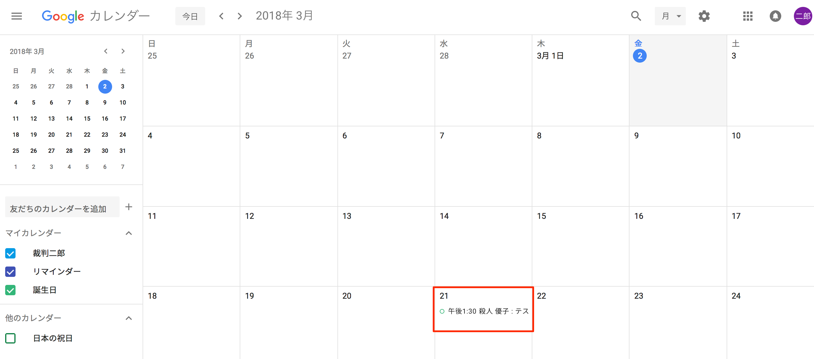
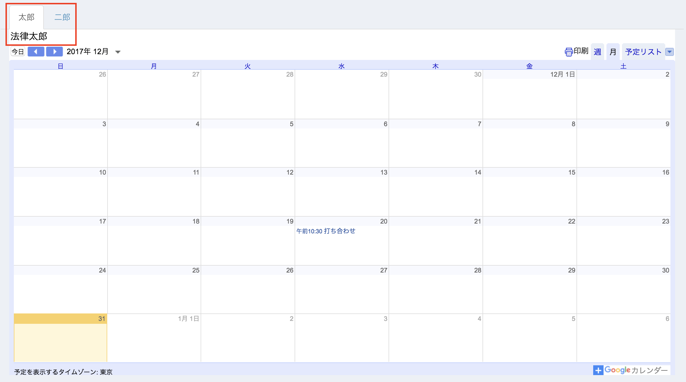

# カレンダー連携

## 特徴

* 打ち合わせや期日、タスクの締め切りなどが、外部のカレンダーに反映されます。
* 2021年11月現在、対応サービスは、Google社のGoogle Calendarと、Microsoft社のOutlookです。&#x20;
* 事務局アカウントで作成した予定は自動的に担当弁護士の予定に反映されます。

## 使い方

１ 歯車ボタン→「プロフィール」をクリックします。

２ 「編集」をクリックします。 

３ 「外部カレンダーサービス連携機能」を選択します。 

\
&#x20;４ご希望のサービス名を選択してページ下部の「更新」ボタンを押します（下図はGoogle Calendarを選択した場合です）。

\
&#x20;５ Google Calendarに、firmeeで登録した予定が反映されるようになります。

## 複数カレンダーの表示

トップページに複数のカレンダーをタブで管理して表示できます。 ※作成方法は[こちら](https://www.slideshare.net/DaisukeIgeta/tutorial-for-calendar)をご参照ください。

こんな方にオススメです。

* 複数の弁護士を担当する事務局アカウント
* プライベートと仕事の予定を分けてGoogle Calendarに登録していて、仕事の予定だけを事務局と共有しつつ、プライベートの予定も自分のトップページには表示させたい弁護士アカウント
* イソ弁の仕事の予定を把握して適切な労務管理を実現させたいボス弁アカウント
