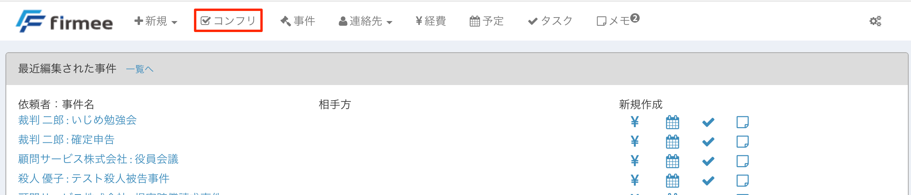

# コンフリクトチェック

ウェブアプリだから、いつでもどこでもコンフリクトチェクが可能です。外部の法律相談などで重宝します。\

## 特徴

* 全連絡先が対象です。 姓、名（法人の場合は会社名）、生年月日、電話番号、郵便番号（７桁）、住所（市町村まで）を対象として、コンフリクトをチェックできます。
* 広めの部分一致で検索します。 登録の際の勘違いや漢字違いも漏らさずチェックするべく、広めの部分一致でアラートを表示します。例えば、法律太郎が登録されている場合、姓で「法」や「律」を検索するとアラートが表示されます。名で「太」や「郎」を検索した場合も同様です。
* 事務所アカウント登録がオススメです。 事務所アカウントユーザーの場合、所内の全ての弁護士の連絡先が対象となります。 \

## 使い方

１ トップページヘッダーのコンフリクボタンをクリックします。

２ 以下の画面が表示されるので、該当箇所に記入してチェックボタンを押します。

 \
&#x20;３ 該当する情報が連絡先として登録されている場合、アラートが表示されます。

\
&#x20;ウェブアプリのコンフリクトチェクを体感すると、もう元には戻れません。\
是非一度お試しください。 無料登録は[こちら](https://www.firmee.com/)
