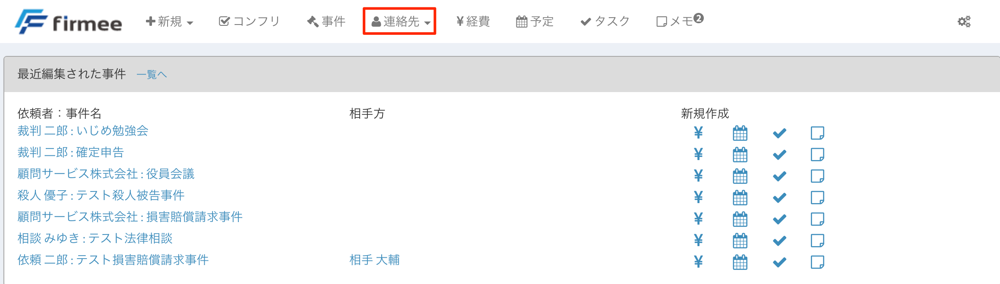
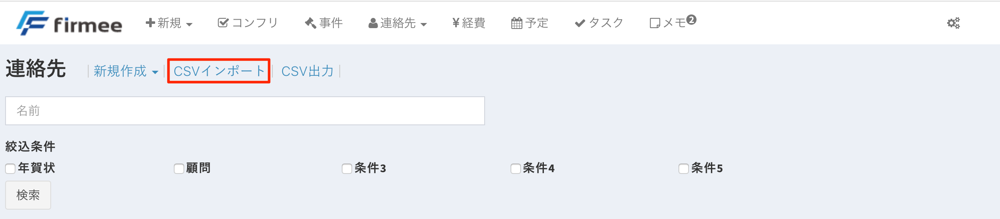
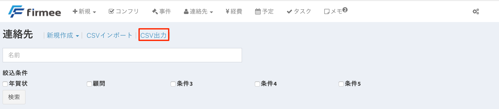
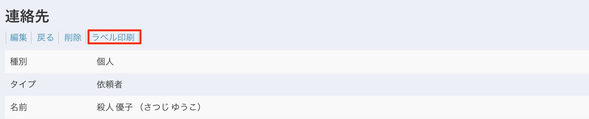

# 連絡先

## 連絡先の基盤として

弁護士が抱える連絡先は、依頼者、相手方、相手方代理人、同期の弁護士など、様々な属性に区分けされます。 firmeeでは雑多な連絡先をひとまとめに管理しつつ、事件や経費と結びつけることができます。 \

## インポート・エクスポート

エクセルなどで既に連絡先を管理している場合には、一括でインポートすることができます。\
&#x20;はじめにトップページの連絡先ボタンをクリックします。

\
&#x20;続いて、CSVインポートボタンをクリックします。

 \
&#x20;年賀状ソフトなどについても個別に対応しています（2018年3月現在の対応ソフトは筆まめです。筆まめ以外のソフトのインポートをご希望の方はお気軽にservice@firmee.comまでお問い合わせください。）。 \

 \
&#x20;また、CSV形式で一括エクスポートも可能です。\

## 宛名ラベルの作成

firmeeに登録した情報を宛名ラベルとして印刷できます。\

 \
&#x20;ラベル印刷ボタンを押すと１２分割のワードファイルが作成されます。

## 連絡先ファイルの作成方法

連絡先は大きく３種類に分かれます。①個人、②法人・行政機関、③法曹です。 \

* 個人

 \
&#x20;連絡先を作成する際は、まず属性を決めます。 属性は①依頼者、②相手方、③知人・取引先、④顧問、⑤その他です。 これらの属性はコンフリクトチェックの際に重要になります。法人・行政機関と法曹でも同様です。

その後それぞれの項目に情報を入力していきます。firmeeは、宛名ラベルや年賀状に活用できるよう、敬称や連名などの項目を設けています。

勤務先などの会社情報も登録できます。 \

* 法人・行政機関、法曹\

 \
&#x20;法人・行政機関や法曹の場合も入力の方法は同様です（画像は法人・行政機関のものです）。

これらの情報は書類作成の際に反映されますので、会社名等は「合同会社firmee」のように正式名称を記入することをお勧めしています。 行政機関の場合は端的に「国」、「東京都」などと入力します。

担当者ボタンを押すと担当者フォームが展開されます。\
&#x20;

\
&#x20;連絡先をまとめて管理して、書面作成に反映できる快適さを是非お試しください。 「無料登録はこちら」
