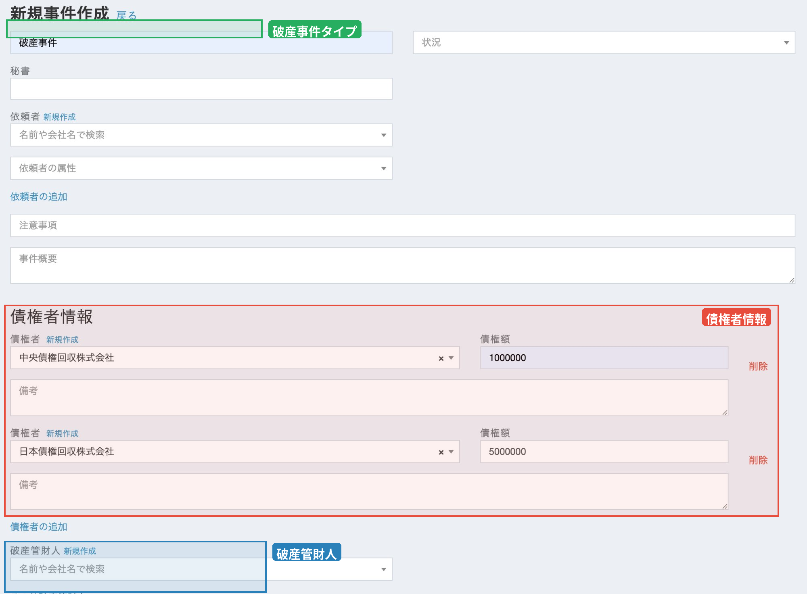
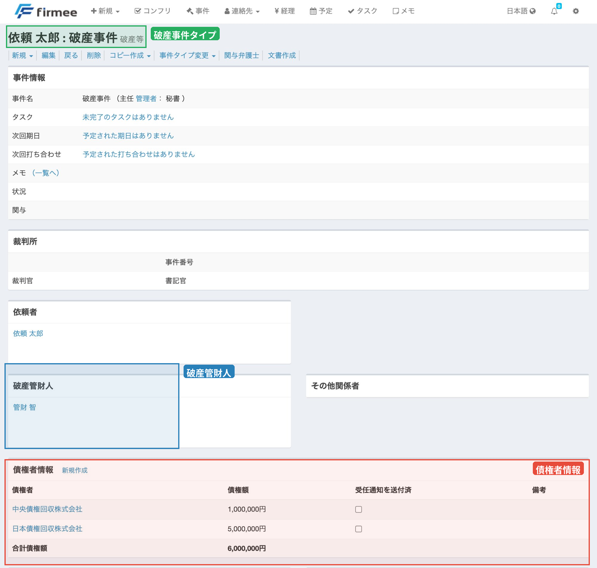

# 破産タイプの事件管理

#### 概要

破産タイプは、破産案件に特化した事件ファイルです。通常の事件情報に加えて、債権者情報の登録・管理機能や破産管財人の登録機能を備えており、破産事件の全体像をひと目で把握できます。

#### 事件の作成

事件の新規作成時に「破産」タイプを選択すると、通常の事件情報に加えて**債権者情報**と**破産管財人**の登録欄が表示されます。

<figure><figcaption></figcaption></figure>

**登録できる情報**

* **事件名**: 事件を識別するための名称（例: 破産事件）
* **秘書**: 担当秘書の選択
* **依頼者**: 依頼者を登録します。既存の連絡先から検索することも、新規作成することも可能です。
* **依頼者の属性**: 依頼者の属性を選択できます
* **注意事項**: 事件に関する注意事項を記録できます
* **事件概要**: 事件の概要を記録できます

**債権者情報の登録**

債権者情報は、事件の作成・編集画面で複数登録できます。

* **債権者**: 債権者名を登録します（例: 中央債権回収株式会社）。既存の連絡先から検索するか、新規作成できます。
* **債権額**: 各債権者に対する債権額を入力します（例: 1,000,000）
* **備考**: 債権者ごとに備考を記録できます

債権者は「削除」ボタンで個別に削除でき、「債権者の追加」リンクから必要に応じて何件でも追加登録が可能です。

**破産管財人の登録**

破産管財人を連絡先として案件に紐づけることができます。既存の連絡先から検索するか、新規作成できます。

#### 事件の詳細画面

事件の詳細画面では、事件の基本情報・依頼者情報・破産管財人・債権者情報をまとめて確認できます。

<figure><figcaption></figcaption></figure>

**事件情報**

画面上部には、事件名・タスク・次回期日・次回打ち合わせ・メモ・状況・関与弁護士などの基本情報が表示されます。

**裁判所**

裁判所に関する以下の情報が表示されます：

* **事件番号**
* **裁判官**
* **書記官**

**依頼者**

依頼者として登録された方の情報が表示されます。名前のリンクから詳細な連絡先情報を確認できます。

**破産管財人**

登録された破産管財人の情報が表示されます。名前のリンクから連絡先情報にすぐアクセスできるので、管財人とのやり取りがスムーズになります。

**その他関係者**

破産管財人以外の関係者が表示されます。

**債権者情報**

登録された債権者が一覧で表示されます。

| 項目           | 説明                          |
| ------------ | --------------------------- |
| **債権者**      | 債権者名（リンクから詳細を確認可能）          |
| **債権額**      | 各債権者への債権額                   |
| **受任通知を送付済** | 各債権者への受任通知の送付状況をチェックボックスで管理 |
| **備考**       | 債権者ごとの備考                    |

**合計債権額**は自動で計算され、一覧の下部に表示されます。

#### 案件一覧での絞り込み

案件一覧に「破産」タブが追加されており、破産事件だけをすぐに一覧表示できます。他の事件タイプと同様に、担当案件の把握がしやすくなっています。

#### 活用例

**例1: 新規の破産案件を受任**

1. 新規作成から「破産」タイプを選択
2. 事件名・依頼者を登録
3. 債権者と債権額を登録
4. 破産管財人を登録
5. 受任通知の送付状況をチェックボックスで管理

**例2: 複数の債権者を管理**

1. 事件の編集画面で債権者を追加
2. 各債権者の債権額を入力
3. 合計債権額は自動計算で確認
4. 受任通知の送付済みチェックで進捗管理

#### こんな先生方におすすめ

* 破産案件を扱っている
* 債権者リストや受任通知の管理をExcelで行っている
* 破産管財人の連絡先をすぐに確認したい
* 案件の全体像をすぐに把握したい

firmeeなら、案件を開くだけで依頼者・債権者・破産管財人・進捗がすべて見渡せます。
