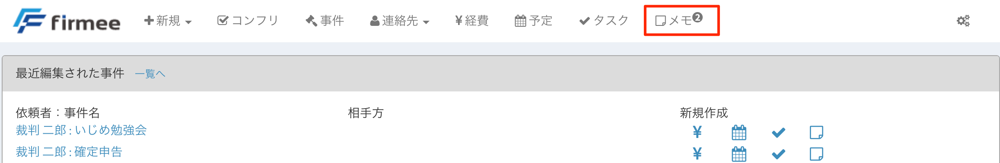
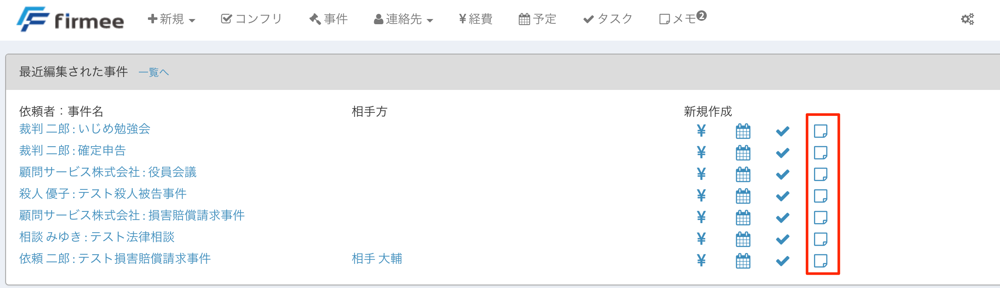
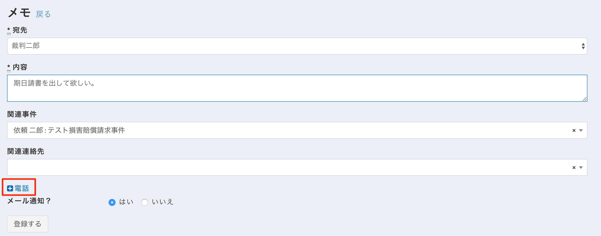
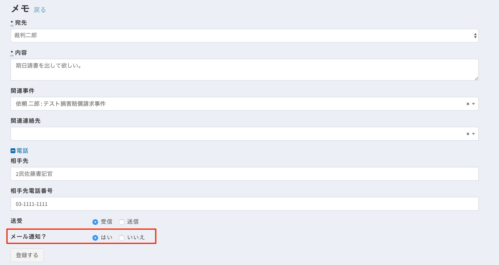

# メモ

電話メモ、期日メモ、打ち合わせメモ、内部メッセージなど、あらゆる場面で重宝します。

## 特徴

* 事件や連絡先に紐づけることで作業の記録（ログ）として保存できます。\
  後から事件ごとに検索可能なので、雑多な作業内容を簡単に管理できます。\
  &#x20;
* CSV出力が可能です。報告書の別紙などとしてご活用ください。
* トップページに通知バッジで通知されます。 

## 使い方

アイコンから作成する方法と新規作成ボタンから作成する方法があります。

**アイコンから作成する** トップページの「最近編集された事件」の一番右のアイコンをクリックします。\

 \
&#x20;**新規作成ボタンから作成する** トップページの新規フォームから展開します。 

いずれでも以下のようなメモの作成フォームに移行します（画像はアイコンから作成し、すでに関連事件が選択されたもの）。

各項目を入力します。 宛先には、通知したい相手を入力します。 \
&#x20;**電話メモを作成する** 電話ボタンを押して展開します。

電話の相手と電話番号を入力します。 \
&#x20;**メール通知** 「メール通知？」を「はい」にすると、事件に関与するすべてのユーザーにメールで通知されます。

 \
&#x20;登録ボタンをクリックすると完成です

