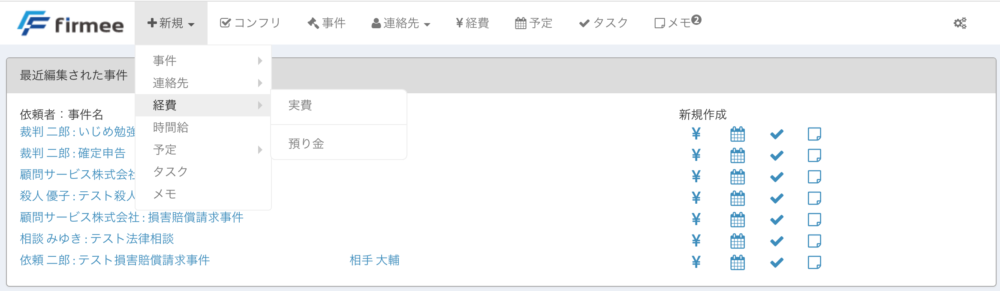

# 経費（実費と預かり金）

事件や依頼者ごとに実費と預かり金を管理できます。 弁護士にとって残金を返還しなければならない債務が「預かり金」、その中から依頼者のために支払ったものや立替払いをして依頼者に請求できる債権となるものが「実費」です。 例えば和解金を支払った場合、「実費」として入力します。 事件終結時に残高がプラスになれば依頼者に請求し、マイナスとなれば依頼者に返還することとなります。

## 特徴

* 事件や依頼者に紐づけて管理することができます。
* 関与弁護士の分も合わせて管理できます。
* CSV出力が可能です。実費だけ、預かり金だけ、両者を統合したものの３種類から選べます。報告書の別紙などとしてご活用ください。

## 使い方

１ トップページの新規作成ボタンから、経費にカーソルを合わせ、実費か預かり金かを選択します。  \
&#x20;２ 必要項目を入力します（画像は実費）。

【入力フォーム】

【入力例】  \
&#x20;３ 事件詳細ページの経費欄に入力内容が反映されます。  \

4 合計金額をクリックすると一覧が表示されます。  \

５ CSV出力ボタンをクリックすると一覧がCSV形式で出力されます。 

利用のたびに経費を入力して、隙間時間を有効活用しましょう。
