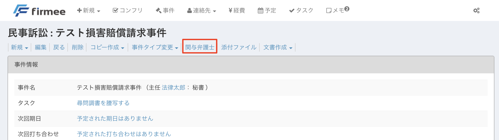
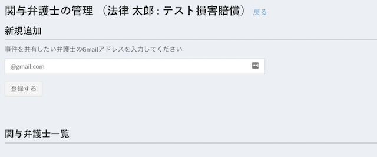

# 関与弁護士

事務所外の弁護士と情報を共有できます。弁護団、委員会、派閥、執筆など、あらゆる場面で重宝します。  

## 特徴

* 事件単位で情報を共有します。
* その事件のあらゆる情報が共有されます。全員が編集可能です。  

## 使い方

１ 事件詳細ページ→「関与弁護士」をクリックします。

２ 関与させたい弁護士のログインアドレスを記入して「登録する」を押します。

３ 入力されたアドレス宛に確認メールが送られます。

４ 「事件共有を承認する」ボタンを押すと、関与弁護士として追加されます。

当該事件に関与中の弁護士の一覧は、事件詳細→「関与弁護士」から確認することができます。

誤って登録した場合や、その弁護士が事件から離脱した場合には、「削除」ボタンで関与弁護士から削除することができます。

## 事件をコピーしたとき

事件詳細の「コピーを作成」で事件をコピーすると、コピー元の関与弁護士（承認済みのもの）と、コピー元の担当弁護士（コピー先では関与弁護士として登録されます）が自動的に引き継がれます。承認待ちの共有招待は引き継がれません。

引き継がれる関与弁護士はコピー画面に一覧表示されるので、保存前に確認できます。同じチームで担当する関連事件をコピーで作る際、共有し直す手間がなくなります。

\
&#x20;類似アプリにはないfirmeeオリジナルです。是非お試しください。
