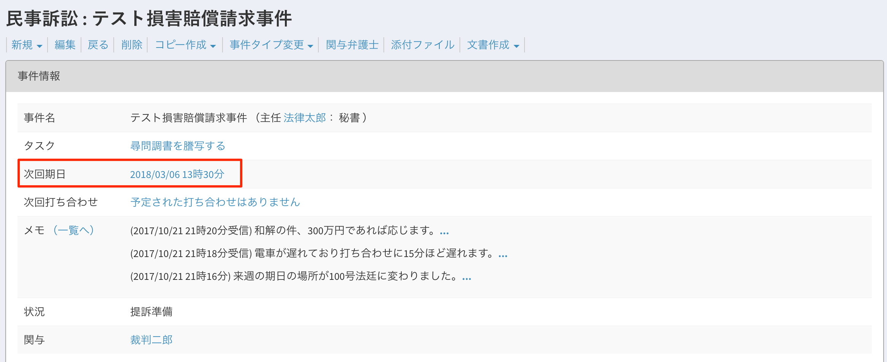

# 予定（期日と打ち合わせ）

期日と打ち合わせを事件や連絡先に紐づけて一括管理できます。 \

## 特徴

* 事件や連絡先に紐づけることで、記録（ログ）として保存できます。
* 作成した予定はGoogle Calendarに反映されます（連携が必要です）。
*   CSV出力が可能です。報告書の別紙などとしてご活用ください。

    **使い方**

1 トップページの新規→予定から期日か打ち合わせを選択します２

 \
&#x20;２ 入力フォームに入力します（画像は期日）。 期日の種類も選択できます（書式に反映されます）。\
&#x20;【入力フォーム】  \
&#x20;【作成完了画面】  \

３ 事件詳細ページに反映されます。 

4 一覧をクリックすると過去の期日を確認できます

