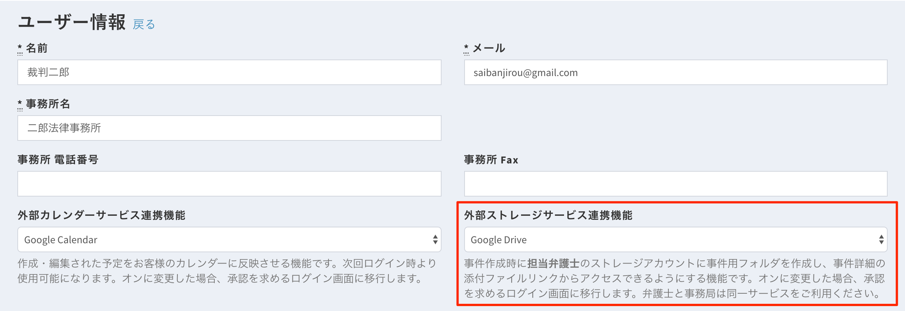
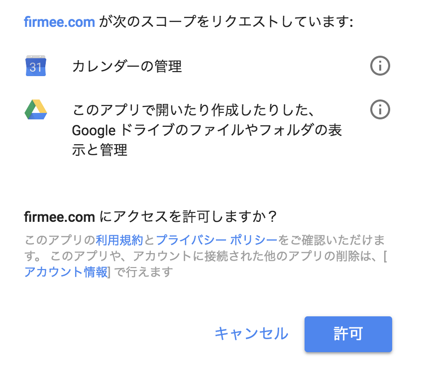
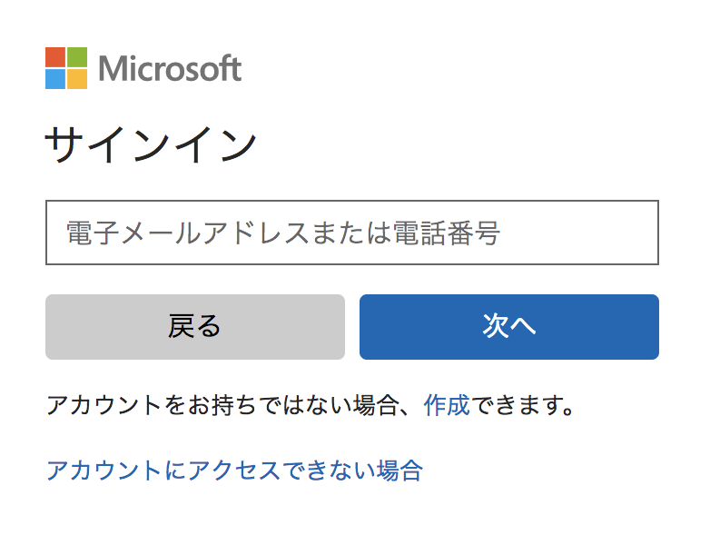
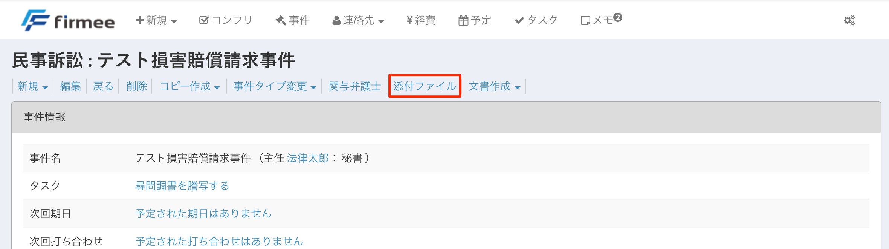
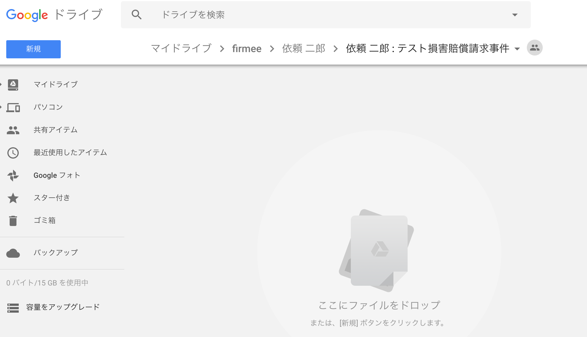
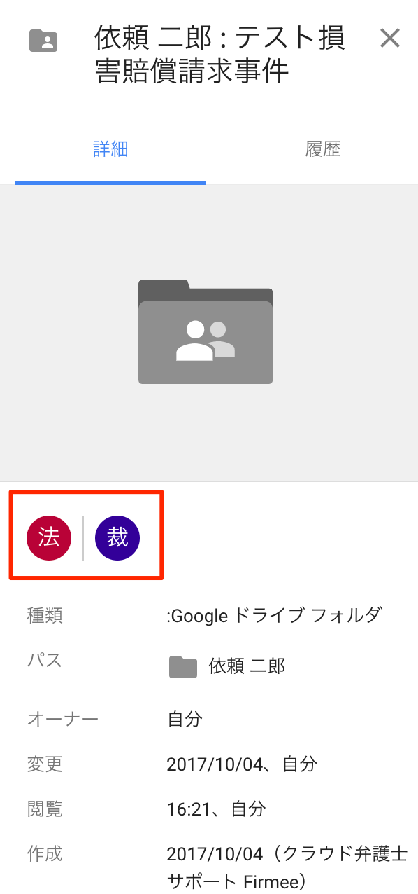

# 外部ストレージ連携

事件を作成すると、外部ストレージソフトにフォルダが自動的に作成されます。\
2018年3月現在、対応ストレージは、Google社のGoogle Drive とMicrosoft社のOneDrive（個人アカウントのみ対応）です。

## 特徴

* 事件ごとに「依頼者名、依頼者名：事件名」フォルダを自動で作成します。
* 事件詳細ページからワンクリックで該当フォルダが開きます。
*   関与弁護士と担当秘書に自動でアクセス権限が付与されます。 \

    **使い方**

１ 歯車ボタン→プロフィールを開きます。

２ 編集ボタンを押します。\

３ 「外部ストレージサービス連携機能」のタブを選択します。

４ 希望する外部ストレージサービスを選択してからページ下部の更新ボタンを押します(画像はGoogle Driveを選択)。

５ 外部ストレージサービスから承認を求められるので、確認して承認します。

【Google Droveの場合】\
 \
&#x20;【OneDriveの場合】\

※2018年3月現在、Microsoft社の仕様により、連携対象は個人アカウントのみとなり、ビジネスアカウント等は連携できません。 \

６ 連携に成功すると、事件詳細ページに「添付ファイル」ボタンが表示されます。

７ 添付ファイルを押すと、外部ストレージアプリに移行し、作成されたフォルダが表示されます。

【Google Driveの場合】\

８ 関与弁護士も自動的にアクセス権限が付与されています。

【Google Driveの場合】

firmeeで事件ファイルを作成するだけで、自動的にストレージサービスにもフォルダが作成され、関与弁護士と秘書の共有設定まで済んでいるというのは、想像以上に快適です。\
是非お試しください。
