# タスク

事件処理で生じるタスクの弁護団内部での記録・共有、文献のコピーや書類の提出といった秘書への依頼事項など、様々な局面で利用することができます。

## 特徴

* 事件や連絡先に紐づけることで作業の記録（ログ）として保存できます。
* CSV出力が可能です。報告書の別紙などとしてご活用ください。
*   締め切り間近のタスクは赤字で表示されます。

    

## 使い方

１ トップページ→「新規」→「タスク」をクリックします。

\
&#x20;２ 必要項目を埋めていきます。 必須項目は件名と担当者だけです 事件と紐づけると事件詳細ページか過去のタスクを確認できます。

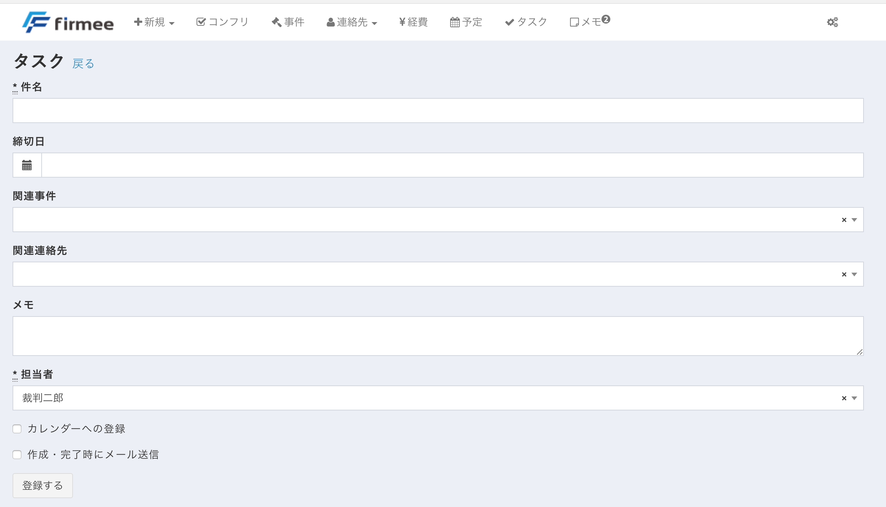

カレンダーに登録すると、連携しているGoogleカレンダーの締切日にタスクが自動的に表示されます。

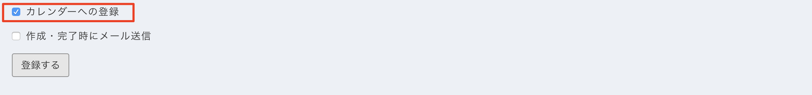

また、「作成・完了時にメール送信」をチェクするとタスクの作成時及び完了時に、タスクの作成者及び担当者にメールが送信されます。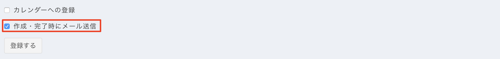

なお、トップページの「最近編集された事件」については、アイコンから簡単にタスクを作成できます

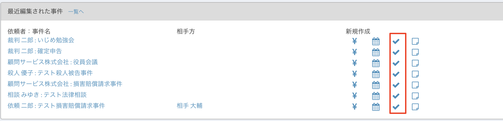

## 確認方法

作成されたタスクは様々な方法で確認できます。

&#x20;**トップページから確認する** トップページには直近１０件のタスクが表示されます。

締切日が3日以内のものは赤く表示されます。

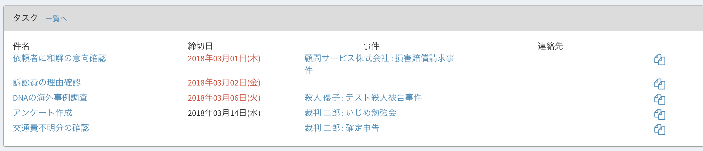

なお、トップページに表示されるタスクについては、右端のアイコンをクリックすると同じ事件のタスクをワンクリックで作成できます。

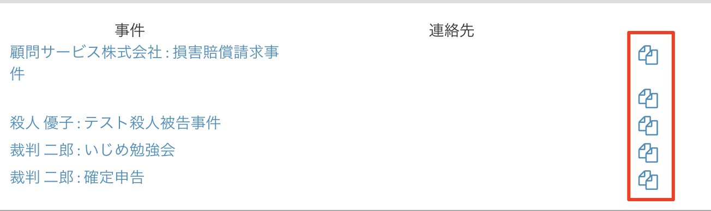

\
&#x20;**タスク一覧を確認する**

トップページのタスクボタンをクリックするか、またはタスクボックスの「一覧へ」をクリックすると、全タスクを確認することができます。

【トップページのタスクボタン】

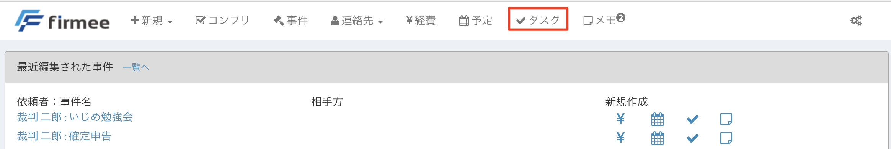

【「一覧へ」ボタン】

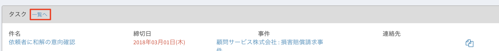 \
&#x20;【一覧表示画面】

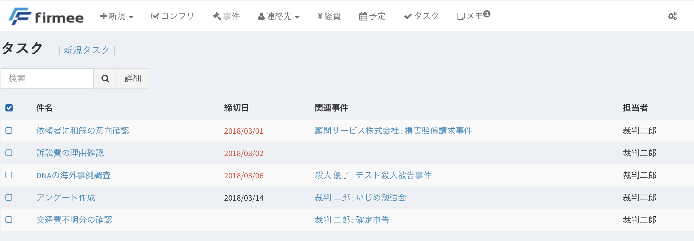

\
&#x20;**事件詳細ページから確認する**

タスクは事件詳細ページから確認することもできます。

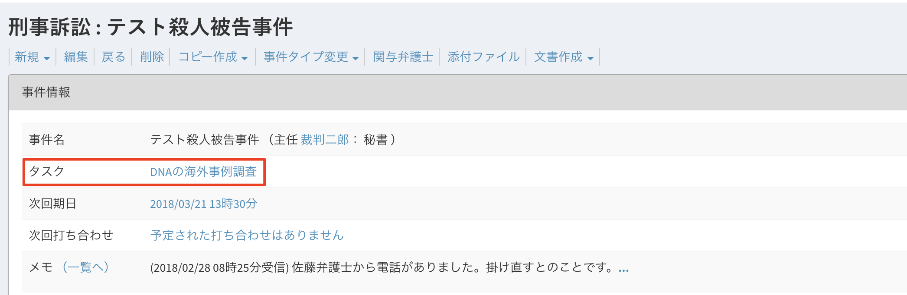

\
&#x20;**タスクの完了** 完了後にチェックボタンを押すことで表示から消去することができます。 \
&#x20;【完了したタスクはチェックすることで・・】

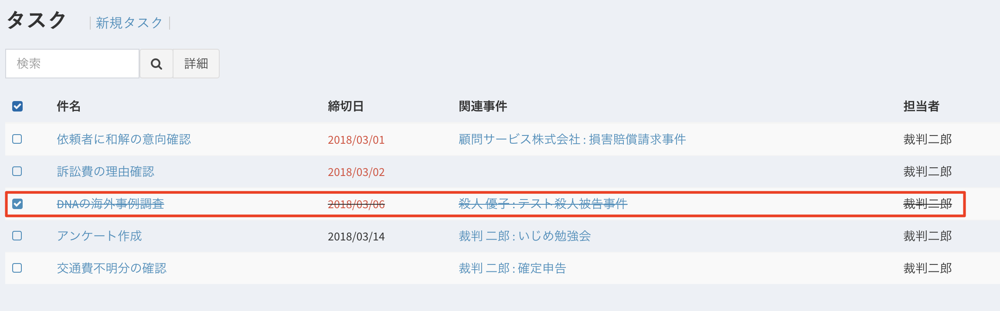

【タスク一覧から表示が消去されます】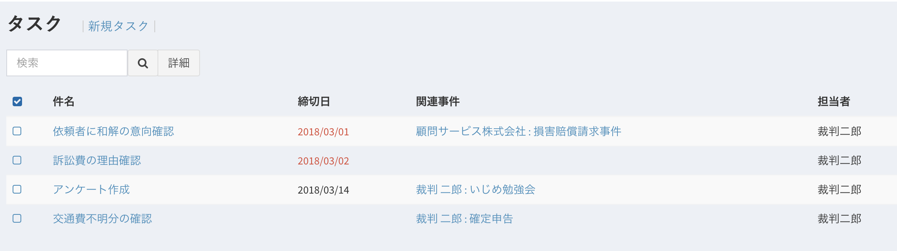

一覧表示からは消去されても、過去のタスクは全て保存されていますので、事件ファイルには表示されます。

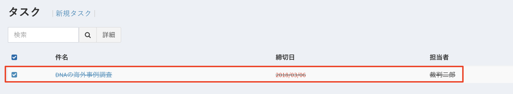

単なるto doリストを超えて、事件ファイルに作業ログを残すことができます。

是非一度お試しください。
